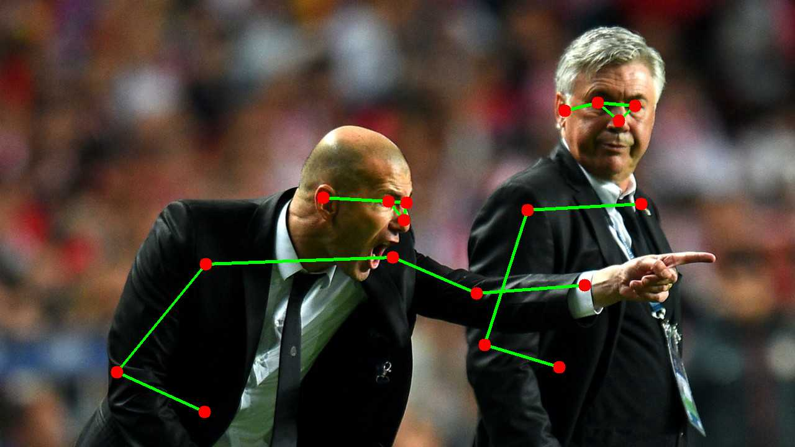
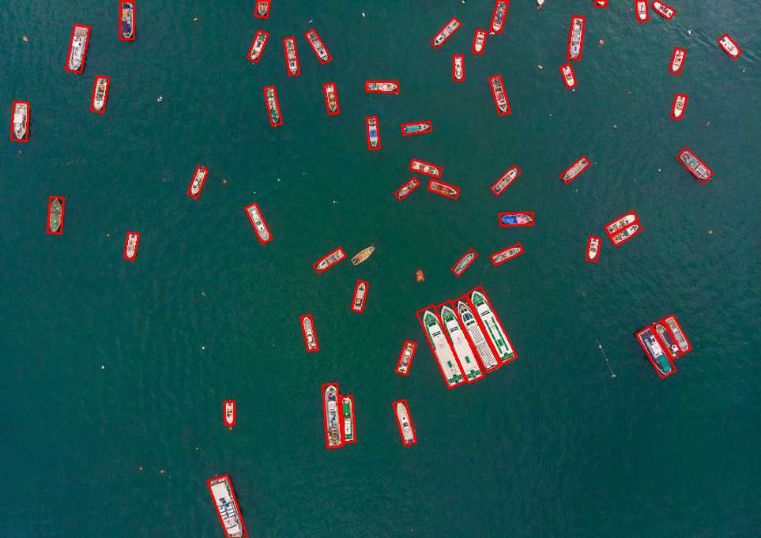

<div align="center" style="text-align: center;">
  
</div>

<p align="center">
   <a href="https://github.com/getcharzp/go-vision/fork" target="blank">
      
   </a>
   <a href="https://github.com/getcharzp/go-vision/stargazers" target="blank">
      
   </a>
   <a href="https://github.com/getcharzp/go-vision/pulls" target="blank">
      
   </a>
</p>

go-vision 基于 Golang + [ONNX](https://github.com/microsoft/onnxruntime/releases/tag/v1.23.2) 构建的视觉库，支持 SAM2、YOLOv11-Det、YOLOv11-Seg、YOLOv11-Cls、YOLOv11-Pose、YOLOv11-OBB、YOLO26-Det、
YOLO26-Seg 等模型。

## 安装

```shell
# 下载包
go get -u github.com/getcharzp/go-vision

# 下载模型、动态链接库
git clone https://huggingface.co/getcharzp/go-vision
```

## 快速开始

### sam2

```go
package main

import (
	"fmt"
	"github.com/getcharzp/go-vision/sam2"
	"github.com/up-zero/gotool/imageutil"
	"log"
)

func main() {
	engine, err := sam2.NewEngine(sam2.DefaultConfig())
	if err != nil {
		log.Fatalf("初始化引擎失败: %v", err)
	}
	defer engine.Destroy()

	img, _ := imageutil.Open("./test.png")
	imgCtx, err := engine.EncodeImage(img)
	if err != nil {
		log.Fatalf("图片 Encode 失败: %v", err)
	}
	defer imgCtx.Destroy()

	points := []sam2.Point{
		{X: 367, Y: 168, Label: sam2.LabelBoxTopLeft},  // 左上
		{X: 441, Y: 349, Label: sam2.LabelBoxBotRight}, // 右下
	}
	imgResult, score, err := imgCtx.Decode(points)
	if err != nil {
		log.Fatalf("Mask Decode 失败: %v", err)
	}

	fmt.Printf("Mask generated, score: %.4f\n", score)
	imageutil.Save("output_mask.png", imgResult, 100)
}

```

| 原图                                                  | Mask图                                                      |
|-----------------------------------------------------|------------------------------------------------------------|
|  |  |

### yolov11-det

```go
package main

import (
	"fmt"
	"github.com/getcharzp/go-vision/yolov11"
	"github.com/up-zero/gotool/imageutil"
	"image"
	"image/color"
	"image/draw"
	"log"
)

func main() {
	engine, err := yolov11.NewDetEngine(yolov11.DefaultDetConfig())
	if err != nil {
		log.Fatalf("初始化引擎失败: %v", err)
	}
	defer engine.Destroy()

	img, _ := imageutil.Open("./test.png")
	results, err := engine.Predict(img)
	if err != nil {
		log.Fatalf("预测失败: %v", err)
	}

	targetImg := image.NewRGBA(img.Bounds())
	draw.Draw(targetImg, img.Bounds(), img, img.Bounds().Min, draw.Src)
	fmt.Printf("检测到目标: %d 个\n", len(results))
	for _, res := range results {
		fmt.Printf("Class: %d, Score: %.2f, Box: %v\n", res.ClassID, res.Score, res.Box)
		imageutil.DrawThickRectOutline(targetImg, res.Box, color.RGBA{R: 255, G: 0, B: 0, A: 255}, 3)
	}
	imageutil.Save("yolov11_det.jpg", targetImg, 50)
}
```

| 原图                                                  | 检测结果                                                       |
|-----------------------------------------------------|------------------------------------------------------------|
|  |  |


### yolov11-seg

```go
package main

import (
	"fmt"
	"github.com/getcharzp/go-vision/yolov11"
	"github.com/up-zero/gotool/imageutil"
	"log"
)

func main() {
	engine, err := yolov11.NewSegEngine(yolov11.DefaultSegConfig())
	if err != nil {
		log.Fatalf("初始化引擎失败: %v", err)
	}
	defer engine.Destroy()

	img, _ := imageutil.Open("./test.png")
	results, err := engine.Predict(img)
	if err != nil {
		log.Fatalf("预测失败: %v", err)
	}

	fmt.Printf("检测到目标: %d 个\n", len(results))
	for idx, res := range results {
		fmt.Printf("Class: %d, Score: %.2f, Box: %v\n", res.ClassID, res.Score, res.Box)
		imageutil.Save(fmt.Sprintf("yolov11_seg_mask_%d.png", idx), res.Mask, 100)
	}
}
```

| 原图                                                  | Mask图                                                             |
|-----------------------------------------------------|-------------------------------------------------------------------|
|  |  |

### yolov11-cls

```go
package main

import (
	"fmt"
	"github.com/getcharzp/go-vision/yolov11"
	"github.com/up-zero/gotool/imageutil"
	"log"
)

func main() {
	engine, err := yolov11.NewClsEngine(yolov11.DefaultClsConfig())
	if err != nil {
		log.Fatalf("初始化引擎失败: %v", err)
	}
	defer engine.Destroy()

	img, _ := imageutil.Open("./test.png")
	results, err := engine.Predict(img, 5)
	if err != nil {
		log.Fatalf("预测失败: %v", err)
	}

	for _, res := range results {
		fmt.Printf("Class: %d, Score: %.5f\n", res.ClassID, res.Score)
	}
}

// 输出：
//  Class: 656, Score: 0.70231
//  Class: 436, Score: 0.22404
//  Class: 511, Score: 0.02263
//  Class: 675, Score: 0.01796
//  Class: 717, Score: 0.00385
```

### yolov11-pose

```go
package main

import (
	"github.com/getcharzp/go-vision/yolov11"
	"github.com/up-zero/gotool/imageutil"
	"log"
)

func main() {
	engine, err := yolov11.NewPoseEngine(yolov11.DefaultPoseConfig())
	if err != nil {
		log.Fatalf("初始化引擎失败: %v", err)
	}
	defer engine.Destroy()

	img, _ := imageutil.Open("./person.jpg")
	results, err := engine.Predict(img)
	if err != nil {
		log.Fatalf("预测失败: %v", err)
	}

	dst := yolov11.DrawPoseResult(img, results)
	imageutil.Save("yolov11_pose.jpg", dst, 50)
}
```

| 原图                                                    | 姿态图                                                         |
|-------------------------------------------------------|-------------------------------------------------------------|
|  |  |

### yolov11-obb

```go
package main

import (
	"github.com/getcharzp/go-vision/yolov11"
	"github.com/up-zero/gotool/imageutil"
	"image"
	"image/color"
	"image/draw"
	"log"
)

func main() {
	engine, err := yolov11.NewOBBEngine(yolov11.DefaultOBBConfig())
	if err != nil {
		log.Fatalf("初始化引擎失败: %v", err)
	}
	defer engine.Destroy()

	img, _ := imageutil.Open("./ship.jpg")
	results, err := engine.Predict(img)
	if err != nil {
		log.Fatalf("预测失败: %v", err)
	}

	dst := image.NewRGBA(img.Bounds())
	draw.Draw(dst, img.Bounds(), img, img.Bounds().Min, draw.Src)
	for _, result := range results {
		imageutil.DrawThickPolygonOutline(dst, result.Corners[:], 3, color.RGBA{R: 255, G: 0, B: 0, A: 255})
	}
	imageutil.Save("yolov11_obb.jpg", dst, 50)
}
```

| 原图                                                  | OBB图                                                       |
|-----------------------------------------------------|------------------------------------------------------------|
|  |  |


### yolo26-det

```go
package main

import (
	"fmt"
	"github.com/getcharzp/go-vision/yolo26"
	"github.com/up-zero/gotool/imageutil"
	"image"
	"image/color"
	"image/draw"
	"log"
)

func main() {
	engine, err := yolo26.NewDetEngine(yolo26.DefaultDetConfig())
	if err != nil {
		log.Fatalf("初始化引擎失败: %v", err)
	}
	defer engine.Destroy()

	img, _ := imageutil.Open("./test.png")
	results, err := engine.Predict(img)
	if err != nil {
		log.Fatalf("预测失败: %v", err)
	}

	targetImg := image.NewRGBA(img.Bounds())
	draw.Draw(targetImg, img.Bounds(), img, img.Bounds().Min, draw.Src)
	fmt.Printf("检测到目标: %d 个\n", len(results))
	for _, res := range results {
		fmt.Printf("Class: %d, Score: %.2f, Box: %v\n", res.ClassID, res.Score, res.Box)
		imageutil.DrawThickRectOutline(targetImg, res.Box, color.RGBA{R: 255, G: 0, B: 0, A: 255}, 3)
	}
	imageutil.Save("yolo26_det.jpg", targetImg, 50)
}
```

| 原图                                                  | 检测结果                                                      |
|-----------------------------------------------------|-----------------------------------------------------------|
|  |  |

### yolo26-seg

```go
package main

import (
	"fmt"
	"github.com/getcharzp/go-vision/yolo26"
	"github.com/up-zero/gotool/imageutil"
	"log"
)

func main() {
	cfg := yolo26.DefaultSegConfig()
	cfg.ModelPath = "../yolo26_weights/yolo26s-seg.onnx"
	cfg.OnnxRuntimeLibPath = "../lib/onnxruntime.dll"

	engine, err := yolo26.NewSegEngine(cfg)
	if err != nil {
		log.Fatalf("初始化引擎失败: %v", err)
	}
	defer engine.Destroy()

	img, _ := imageutil.Open("./test.png")
	results, err := engine.Predict(img)
	if err != nil {
		log.Fatalf("预测失败: %v", err)
	}

	fmt.Printf("检测到目标: %d 个\n", len(results))
	for idx, res := range results {
		fmt.Printf("Class: %d, Score: %.2f, Box: %v\n", res.ClassID, res.Score, res.Box)
		imageutil.Save(fmt.Sprintf("yolo26_seg_mask_%d.png", idx), res.Mask, 100)
	}
}
```

| 原图                                                  | Mask图                                                            |
|-----------------------------------------------------|------------------------------------------------------------------|
|  |  |

