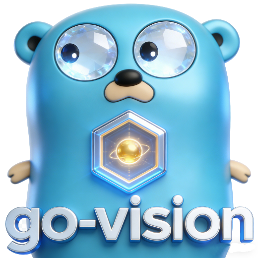
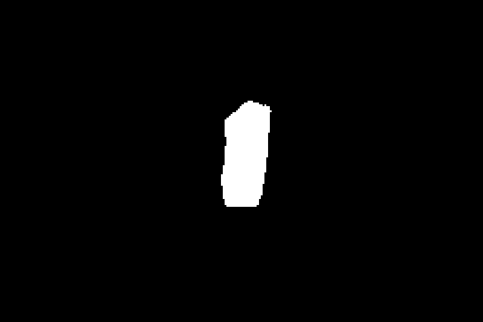

<div align="center" style="text-align: center;">
  
</div>

<p align="center">
   <a href="https://github.com/getcharzp/go-vision/fork" target="blank">
      
   </a>
   <a href="https://github.com/getcharzp/go-vision/stargazers" target="blank">
      
   </a>
   <a href="https://github.com/getcharzp/go-vision/pulls" target="blank">
      
   </a>
   <a href='https://github.com/getcharzp/go-vision/releases'>
      
   </a>
</p>

go-vision 基于 Golang + [ONNX](https://github.com/microsoft/onnxruntime/releases/tag/v1.23.2) 构建的轻量级视觉库

## 安装

```shell
# 下载包
go get -u github.com/getcharzp/go-vision

# 下载模型、动态链接库
git clone https://huggingface.co/getcharzp/go-vision
```

## 快速开始

### sam2

```go
package main

import (
	"fmt"
	"github.com/getcharzp/go-vision/sam2"
	"github.com/up-zero/gotool/imageutil"
	"log"
)

func main() {
	engine, err := sam2.NewEngine(sam2.DefaultConfig())
	if err != nil {
		log.Fatalf("初始化引擎失败: %v", err)
	}
	defer engine.Destroy()

	img, _ := imageutil.Open("./test.png")
	imgCtx, err := engine.EncodeImage(img)
	if err != nil {
		log.Fatalf("图片 Encode 失败: %v", err)
	}
	defer imgCtx.Destroy()

	points := []sam2.Point{
		{X: 367, Y: 168, Label: sam2.LabelBoxTopLeft},  // 左上
		{X: 441, Y: 349, Label: sam2.LabelBoxBotRight}, // 右下
	}
	imgResult, score, err := imgCtx.Decode(points)
	if err != nil {
		log.Fatalf("Mask Decode 失败: %v", err)
	}

	fmt.Printf("Mask generated, score: %.4f\n", score)
	imageutil.Save("output_mask.png", imgResult, 100)
}

```

| 原图                                                  | Mask图                                                      |
|-----------------------------------------------------|------------------------------------------------------------|
|  |  |
